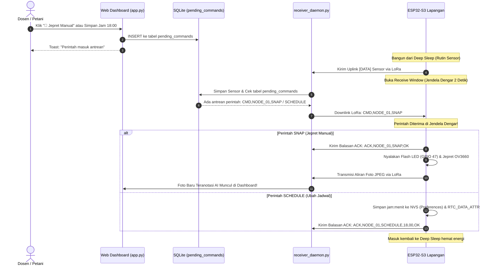

# 🌾 Sistem Pemantauan Hama Perangkap Feromon (Insect Trap Monitoring IoT & AI)
**Berbasis ESP32-S3 CAM, LoRa Ebyte E220-900T22D, Raspberry Pi 5, & Deteksi AI (YOLOv8 + OpenCV)**  
*Lab ELINS - Departemen Ilmu Komputer dan Elektronika, Universitas Gadjah Mada*

Proyek ini adalah sistem IoT nirkabel terpadu untuk memantau populasi serangga hama (khususnya kupu kaper *Spodoptera exigua*) di dalam perangkap ber-feromon lem perekat kuning di lahan perkebunan bawang merah/cabai. 

Sistem secara otomatis mengambil foto resolusi tinggi, membaca kondisi suhu & kelembaban lingkungan via sensor DHT22 & RTC DS3231, mengendalikan kipas pendingin cerdas, serta mendukung **Komunikasi Dua Arah (*Bidirectional LoRa Control*)** untuk memicu jepretan kamera manual (*on-demand snapshot*) maupun mengubah jadwal jepret harian secara dinamis langsung dari **Web Dashboard**. Data dikirimkan secara nirkabel jarak jauh (Long Range LoRa 915 MHz) ke **Stasiun Pusat Raspberry Pi 5**. Di Raspberry Pi 5, foto diolah menggunakan **AI Deep Learning (YOLOv8) & Computer Vision Adaptif** untuk menghitung populasi serangga secara instan, mengklasifikasikan tingkat ancaman, serta menyajikan hasilnya pada **Web Dashboard Real-Time** yang dapat diakses oleh petani dari smartphone di mana saja melalui jaringan mesh **Tailscale**.

---

## 📑 Daftar Isi
1. [Arsitektur Sistem Keseluruhan](#-1-arsitektur-sistem-keseluruhan)
2. [Spesifikasi Hardware & Pinout](#-2-spesifikasi-hardware--pinout)
3. [Daftar & Fungsi Program Komprehensif](#-3-daftar--fungsi-program-komprehensif)
4. [Fitur Komunikasi 2 Arah (Bidirectional LoRa Control & Dynamic Scheduling)](#-4-fitur-komunikasi-2-arah-bidirectional-lora-control--dynamic-scheduling)
5. [Alur Setup & Deployment Raspberry Pi 5](#-5-alur-setup--deployment-raspberry-pi-5)
6. [Akses Jarak Jauh via Tailscale Mesh VPN](#-6-akses-jarak-jauh-via-tailscale-mesh-vpn)
7. [Engine Deteksi Hama AI (YOLOv8 & OpenCV Dual-Engine)](#-7-engine-deteksi-hama-ai-yolov8--opencv-dual-engine)
8. [Pelatihan Model YOLO di Google Colab](#-8-pelatihan-model-yolo-di-google-colab)
9. [Panduan Menjalankan Sistem & Web Dashboard](#-9-panduan-menjalankan-sistem--web-dashboard)
10. [Troubleshooting & Solusi Kendala](#-10-troubleshooting--solusi-kendala)

---

## 🏗️ 1. Arsitektur Sistem Keseluruhan

```text
┌─────────────────────────────────────────────────────────────┐
│               NODE TRANSMITTER (KEBUN / SAWAH)              │
│  - ESP32-S3 CAM (OV3660 + Octal PSRAM)                      │
│  - Sensor DHT22 (Suhu & Kelembaban)                         │
│  - RTC DS3231 (Jadwal Kipas 07:00-17:00 & Sinkronisasi Jam) │
│  - Lampu Flash LED Pentol 5mm (GPIO 47)                     │
│  - Kipas Mini DC 5V (GPIO 21 via Transistor NPN 2N2222)     │
│  - Catu Daya HLK 5V 2A (AC 220V PLN ke DC 5V)               │
│  - Modul LoRa Ebyte E220-900T22D (TXD: GPIO 41, RXD: GPIO 42)│
│  - Fitur: Receive Window 2 Detik & NVS Preferences Storage  │
└──────────────────────▲──────────────┬───────────────────────┘
                       │              │
        Downlink Perintah LoRa        │ Gelombang Radio LoRa 915 MHz (1-3 km)
        (SNAP / Set Jadwal)           │ Format: [DATA] Sensor + Biner JPEG
                       │              │
                       │              ▼
┌──────────────────────┴──────────────┴───────────────────────┐
│               NODE RECEIVER (STASIUN PENERIMA)              │
│  - Modul LoRa Ebyte E220-900T22D (TXD: Pin 16, RXD: Pin 17) │
│  - ESP32 Dev Module (Mode Transparent Passthrough 2 Arah)   │
└──────────────────────▲──────────────┬───────────────────────┘
                       │              │
            Kirim CMD Serial          │ Kabel USB Serial (/dev/ttyUSB0 @ 115200)
            ke ESP32 Bridge           │ Aliran Data Sensor & Foto JPEG
                       │              ▼
┌──────────────────────┴──────────────────────────────────────┐
│                RASPBERRY PI 5 (2GB / 4GB / 8GB)             │
│                                                             │
│  ┌───────────────────────────────────────────────────────┐  │
│  │ 1. receiver_daemon.py (Background Thread)             │  │
│  │    - Membaca serial /dev/ttyUSB0                      │  │
│  │    - Parsing data sensor multi-node (Node 1 & 2)      │  │
│  │    - Injeksi Downlink Perintah Tertunda (Pending CMD) │  │
│  │    - Rekonstruksi paket biner JPEG menjadi file .jpg  │  │
│  │    - Menyimpan log ke SQLite & sensor_history.csv     │  │
│  └───────────────────────────┬───────────────────────────┘  │
│                              │ Memicu deteksi otomatis      │
│                              ▼                              │
│  ┌───────────────────────────────────────────────────────┐  │
│  │ 2. kaper_counter_rpi5.py (AI & Vision Engine)         │  │
│  │    - YOLOv8 ONNX CPU Accelerator (OpenCV DNN)         │  │
│  │    - Dual-Channel LAB b* + CLAHE + Watershed Split   │  │
│  │    - Klasifikasi: Aman (0-4), Waspada (5-9), Bahaya  │  │
│  │      (≥10 ngengat/perangkap/hari)                    │  │
│  │    - Output: Foto beranotasi bounding box hijau       │  │
│  └───────────────────────────┬───────────────────────────┘  │
│                              │ Menyimpan hasil deteksi      │
│                              ▼                              │
│  ┌───────────────────────────────────────────────────────┐  │
│  │ 3. app.py (Flask Web Server - Port 5000)              │  │
│  │    - UI Dashboard Interaktif (Tailwind CSS, Chart.js) │  │
│  │    - Panel Kontrol Dua Arah (Jepret Manual & Jadwal)  │  │
│  │    - REST API: /api/command/trigger, /schedule, /status│ │
│  │    - Selector Multi-Node & Ekspor CSV                 │  │
│  └───────────────────────────────────────────────────────┘  │
└──────────────────────────────┬──────────────────────────────┘
                               │
             ┌─────────────────┴─────────────────┐
             ▼                                   ▼
   [Wi-Fi Lokal / LAN]                  [Tailscale Mesh VPN]
   http://192.168.x.x:5000              http://100.x.y.z:5000
             │                                   │
             └─────────────────┬─────────────────┘
                               ▼
                 [Smartphone / Laptop Petani]
       (Kirim Perintah Jepret & Pantau Hama dari Mana Saja)
```

---

## 🛠️ 2. Spesifikasi Hardware & Pinout

### A. Transmitter Node (ESP32-S3-CAM di Lapangan)
| Komponen | Pin Komponen | Terhubung ke ESP32-S3 | Catatan Khusus |
| :--- | :--- | :--- | :--- |
| **LoRa Ebyte E220** | VCC & GND | **5V & GND** | Arus puncak ~120 mA saat memancar |
| | TXD & RXD | **GPIO 41 (RX) & GPIO 42 (TX)** | Komunikasi UART1 Serial (115200 bps) |
| | M0 & M1 | **GND & GND** | **Wajib ke GND** untuk mode normal transparan (Transceiver) |
| **Sensor DHT22** | DATA | **GPIO 1** | Beri resistor pull-up 4.7kΩ–10kΩ ke 3.3V |
| **RTC DS3231** | SDA & SCL | **GPIO 2 (SDA) & GPIO 3 (SCL)** | I2C Hardware Bus |
| **Flash LED Pentol** | Anoda (+) | **GPIO 47** | **Wajib seri resistor 150Ω–220Ω ke anoda** |
| **Kipas DC 5V** | Positif (+) | **+5V HLK-PM01** | Sumber daya 5V langsung |
| | Negatif (-) | **Kolektor Transistor NPN 2N2222** | Sakelar pemutus GND |
| **Transistor Kipas** | Basis (B) | **GPIO 21** | **Wajib seri resistor 1kΩ**. Kipas aktif jam 07:00-17:00 |
| | Emitor (E) | **GND** | Ground |

### B. Receiver Node (ESP32 Dev Module ke Raspberry Pi 5)
| Modul LoRa Ebyte E220 | ESP32 Dev Module | Keterangan |
| :--- | :--- | :--- |
| **VCC & GND** | **Pin 5V (VIN) & GND** | Suplai tegangan |
| **TXD** | **GPIO 16 (RX2)** | LoRa TX -> ESP32 RX |
| **RXD** | **GPIO 17 (TX2)** | LoRa RX -> ESP32 TX |
| **M0 & M1** | **GND & GND** | **Wajib ke GND** (Mode 0: Transceiver Transparan) |
| **Port USB ESP32** | **Port USB Raspberry Pi 5** | Kabel data USB membentuk `/dev/ttyUSB0` |

---

## 📂 3. Daftar & Fungsi Program Komprehensif

Berikut adalah penjelasan seluruh file program yang ada di dalam repositori:

### 📁 Bagian 1: Firmware Mikrokontroler (Arduino C++)
1. **`V3_ESP32S3_LoRa_Trap/3_Transmitter_ESP32S3/Transmitter_ESP32S3/Transmitter_ESP32S3.ino`**:
   - Firmware utama untuk ESP32-S3-CAM di kebun.
   - Mengontrol siklus Deep Sleep hemat energi (bangun setiap 30 detik untuk pengujian lab atau 30 menit di kebun).
   - Membaca suhu & kelembaban DHT22, waktu presisi RTC DS3231, dan mengevaluasi jadwal kipas (ON pukul 07:00–17:00).
   - **Fitur Baru (Komunikasi 2 Arah)**:
     - Membuka **Receive Window selama 2 detik** tepat setelah mengirimkan data sensor untuk mendengarkan perintah downlink dari Raspberry Pi.
     - Mem-parse perintah jepret manual (`CMD,NODE_XX,SNAP`) dan pengubahan jadwal (`CMD,NODE_XX,SCHEDULE,HH,MM`).
     - Menyimpan konfigurasi jadwal ke memori non-volatile NVS via library `Preferences.h` dan `RTC_DATA_ATTR` agar jadwal baru tidak hilang walau baterai dicabut.
     - Mengirimkan balasan konfirmasi `ACK` ke stasiun penerima.
   - Menyalakan Flash LED pentol via GPIO 47 dan menjepret foto JPEG OV3660 dengan kualitas jernih (JPEG Quality 10).
   - Memecah data biner foto menjadi paket-paket kecil (*chunking* 150 byte @ 40ms) dan mengirimkannya via LoRa E220.
   - Mendukung identitas unik node (`NODE_01`, `NODE_02`) dan penjadwalan anti-tabrakan (*anti-collision schedule*).

2. **`V3_ESP32S3_LoRa_Trap/4_Receiver_ESP32_Standalone/Receiver_ESP32_Standalone/Receiver_ESP32_Standalone.ino`**:
   - Firmware jembatan (*bridge*) untuk ESP32 Receiver.
   - Bekerja secara dua arah (*bidirectional passthrough*):
     - LoRa →
→→ USB: Meneruskan data sensor dan aliran biner JPEG dari kebun ke Raspberry Pi.
     - USB →
→→ LoRa: Meneruskan perintah downlink dari Raspberry Pi ke LoRa tanpa modifikasi karakter.

---

### 📁 Bagian 2: Layanan Stasiun Penerima Raspberry Pi 5 (`pi_service/`)
Folder: `V3_ESP32S3_LoRa_Trap/5_Receiver_RaspberryPi5_Dashboard/pi_service/`

1. **`app.py`** *(Program Utama & Web Server)*:
   - Aplikasi server Web Dashboard berbasis framework **Flask**.
   - **Otomatis menjalankan `receiver_daemon.py` di thread latar belakang**, sehingga Anda cukup menjalankan file ini untuk mengaktifkan seluruh sistem.
   - **Sistem Autentikasi Login**: Fitur kontrol (Jepret Manual & Ubah Jadwal) memerlukan login terlebih dahulu. Kredensial default: `petani` / `petani`. Menggunakan Flask session.
   - Menyediakan REST API:
     - `/api/latest?node=NODE_01`: Mengembalikan status sensor dan foto teranotasi terbaru.
     - `/api/nodes`: Mengembalikan daftar seluruh node transmitter yang aktif.
     - `/api/history`: Riwayat tren suhu & kelembaban per tanggal/jam.
     - `/api/detections`: Riwayat tangkapan foto dan kalkulasi jumlah hama.
     - `/export/csv`: Mengunduh berkas log data format CSV Excel.
     - **API Autentikasi**:
       - `POST /api/auth/login`: Login dengan `{"username": "petani", "password": "petani"}`.
       - `POST /api/auth/logout`: Logout dan hapus sesi.
       - `GET /api/auth/check`: Memeriksa status login saat ini.
     - **API Kontrol (Memerlukan Login)**:
       - `POST /api/command/trigger`: Memicu jepret manual untuk node tertentu. **Wajib login.**
       - `POST /api/command/schedule`: Mengubah jadwal foto harian (jam & menit). **Wajib login.**
       - `GET /api/command/status`: Memeriksa antrean perintah dan jadwal aktif.

2. **`receiver_daemon.py`** *(Background Serial Worker & Downlink Injector)*:
   - Terhubung ke `/dev/ttyUSB0` pada 115200 baud.
   - Membaca teks sensor `[DATA]` dan mencatatnya ke database SQLite `trap_monitoring.db` dan `sensor_history.csv`.
   - **Injeksi Downlink LoRa**: Sesaat setelah data sensor tersimpan, daemon memeriksa tabel `pending_commands`. Jika terdapat perintah yang belum dieksekusi untuk node tersebut, perintah langsung dikirim via serial USB ke modul LoRa dalam jendela dengar (*Receive Window*) 2 detik node transmitter.
   - Menangkap penanda awal foto `---START:NODE_XX---`, mengumpulkan byte biner JPEG secara utuh ke buffer memori, dan menyimpannya menjadi file gambar fisik di `static/captures/`.
   - Otomatis memanggil engine `kaper_counter_rpi5.py` begitu gambar selesai diunduh.

3. **`kaper_counter_rpi5.py`** *(Engine Penghitung Hama AI & Vision)*:
   - Inti pemrosesan kecerdasan buatan (*AI Image Processing*) yang sangat ringan (RAM < 80 MB, waktu proses ~150–250 ms di CPU Raspberry Pi 5).
   - **Dual-Engine Otomatis**:
     - Jika ada file `kaper_yolo.onnx`, sistem menggunakan **YOLOv8 Deep Learning** via akselerasi **OpenCV DNN**.
     - Jika file ONNX tidak ada, sistem otomatis beralih ke **OpenCV Adaptif Klasik (LAB b-channel + CLAHE + Watershed Cluster Split)** yang terbukti handal mendeteksi kaper di plat lem kuning.
   - Menggambar kotak pembatas (*bounding box*) hijau, label nomor ID serangga (`#1`, `#2`), dan banner status ancaman di bagian atas foto.

4. **`kaper_config.json`**:
   - File konfigurasi parameter kalibrasi computer vision (ambang batas warna, filter area minimal/maksimal kontur, rasio aspek serangga).

5. **`simulate_feed.py`**:
   - Skrip pengujian mandiri untuk menyimulasikan transmisi gambar masuk ke dashboard tanpa perlu alat pemancar fisik:
     `python3 simulate_feed.py test_lem_kuning.jpg NODE_01`

6. **`setup_autostart.sh`**:
   - Skrip bash untuk mendaftarkan layanan `insect_trap.service` ke `systemd` Linux agar dashboard menyala otomatis saat Raspberry Pi dihidupkan.

7. **`templates/index.html`**:
   - Antarmuka web modern responsif **"Dashboard Pemantauan Trap Hama Kaper"** dengan fitur:
     - **Mode Siang/Malam (*Light/Dark Mode*)**: Toggle di navbar, preferensi tersimpan di localStorage.
     - **Autentikasi Login**: Fitur kontrol (Jepret Manual & Ubah Jadwal) terkunci dan memerlukan login (`petani` / `petani`). Panel kontrol ditampilkan dengan overlay terkunci saat belum login.
     - **Logo Profesional**: SVG logo perisai dengan siluet serangga dan gradien emerald.
     - **Branding Institusi**: Menampilkan nama "Lab Riset Elektronika dan Instrumentasi - Universitas Gadjah Mada • 2026".
     - **Ambang Batas Hama Terbaru**: 🟢 Aman (0-4), 🟡 Waspada (5-9), 🔴 Bahaya (≥10 ngengat/perangkap/hari).
     - Widget kartu metrik KPI, komparator foto asli vs deteksi AI, grafik interaktif Chart.js, kartu Kontrol Dua Arah & Penjadwalan Jarak Jauh, galeri riwayat deteksi, dan footer universitas.
     - Desain glassmorphism, font Inter, animasi hover halus, dan transisi tema dinamis pada seluruh komponen termasuk grafik Chart.js.

---

### 📁 Bagian 3: Pelatihan AI Google Colab
- **`Training_YOLO_Kaper_Colab.ipynb`**:
  - Jupyter Notebook untuk melatih (*fine-tuning*) arsitektur model **YOLOv8-Nano** menggunakan GPU Tesla T4 gratis di Google Colab.
  - Membaca dataset anotasi CVAT, melatih 80 epoch, mengevaluasi kurva *Precision-Recall (mAP)*, mengekspor ke format ONNX (`kaper_yolo.onnx`), dan men-download otomatis ke laptop Anda.

---

## 📡 4. Fitur Komunikasi 2 Arah (Bidirectional LoRa Control & Dynamic Scheduling)

Fitur ini dirancang untuk menjawab kebutuhan pengujian dan operasional fleksibel di lapangan:
1. **Trigger Jepret Manual (*On-Demand Capture*)**: Memerintahkan kamera di kebun untuk langsung mengambil foto seketika saat diinginkan dari Web Dashboard.
2. **Pengaturan Jadwal Foto Dinamis**: Mengubah jam pengambilan foto harian (misal: disetel pukul 18:00 saat hama aktif senja) secara nirkabel tanpa perlu memprogram ulang mikrokontroler.

### 🔍 Apakah Perlu Komponen Tambahan?
> [!IMPORTANT]
> **TIDAK ADA KOMPONEN HARDWARE TAMBAHAN SAMA SEKALI (0 Komponen Tambahan).**  
> - Modul **LoRa Ebyte E220-900T22D** di kedua sisi sudah merupakan transceiver *half-duplex*.
> - Kedua modul dihubungkan pada **Mode 0 (M0=GND, M1=GND)** yang mendukung transmisi dan penerimaan secara transparan.
> - Seluruh fitur ini merupakan **peningkatan perangkat lunak, firmware, database, dan protokol komunikasi**.

---

### ⏱️ Mekanisme Protokol "Receive Window" (LoRaWAN Class A Style)
Karena ESP32-S3 berada dalam mode *Deep Sleep* untuk menghemat daya baterai, radio LoRa tidak mendengarkan sinyal terus-menerus. Oleh karena itu, diterapkan mekanisme **Receive Window 2 Detik**:



---

### 📋 Format Protokol Perintah (Packet Syntax)

| Arah | Sintaks Paket | Deskripsi |
| :--- | :--- | :--- |
| **Downlink** (RPi -> Node) | `CMD,<NODE_ID>,SNAP` | Perintah jepret foto manual instan. |
| **Downlink** (RPi -> Node) | `CMD,<NODE_ID>,SCHEDULE,<HH>,<MM>` | Ubah jadwal foto ke jam HH dan menit MM (misal CMD,NODE_01,SCHEDULE,18,00). |
| **Uplink ACK** (Node -> RPi) | `ACK,<NODE_ID>,SNAP,OK` | Konfirmasi perintah jepret diterima. |
| **Uplink ACK** (Node -> RPi) | `ACK,<NODE_ID>,SCHEDULE,<HH>,<MM>,OK` | Konfirmasi jadwal baru berhasil disimpan ke NVS. |

---

### 🗄️ Struktur Tabel Antrean Database (`pending_commands`)
Tabel baru yang otomatis dibuat di `trap_monitoring.db`:
```sql
CREATE TABLE IF NOT EXISTS pending_commands (
    id INTEGER PRIMARY KEY AUTOINCREMENT,
    timestamp_created TEXT,     -- Waktu perintah dibuat di web (YYYY-MM-DD HH:MM:SS)
    node_id TEXT,               -- Target Node ('NODE_01', 'NODE_02')
    command_type TEXT,          -- 'SNAP' atau 'SCHEDULE'
    command_payload TEXT,       -- Parameter tambahan (misal: '18:00')
    command_str TEXT,           -- Format string utuh ('CMD,NODE_01,SNAP')
    executed INTEGER DEFAULT 0, -- 0 = Menunggu dikirim, 1 = Sudah terkirim ke node
    executed_at TEXT            -- Waktu perintah berhasil diinjeksikan ke LoRa
);
```

---

### 🌐 Dokumentasi REST API Kontrol Dua Arah

> [!IMPORTANT]
> Endpoint `POST /api/command/trigger` dan `POST /api/command/schedule` **memerlukan login terlebih dahulu**. Tanpa login, server akan mengembalikan HTTP 403 Forbidden.

#### 0. Login Autentikasi
- **URL**: `POST /api/auth/login`
- **Body JSON**:
  ```json
  { "username": "petani", "password": "petani" }
  ```
- **Respons Sukses** (HTTP 200):
  ```json
  { "status": "success", "message": "Login berhasil! Selamat datang, Petani." }
  ```
- **Respons Gagal** (HTTP 401):
  ```json
  { "status": "error", "message": "Username atau password salah." }
  ```

#### 1. Memicu Jepret Manual
- **URL**: `POST /api/command/trigger` *(Wajib login)*
- **Body JSON**:
  ```json
  { "node_id": "NODE_01" }
  ```
- **Respons Sukses**:
  ```json
  {
    "status": "success",
    "message": "Perintah jepret manual untuk NODE_01 masuk antrean (#1). Akan dikirim saat node bangun dari Deep Sleep berikutnya.",
    "command_id": 1,
    "command_str": "CMD,NODE_01,SNAP"
  }
  ```

#### 2. Mengubah Jadwal Foto Harian
- **URL**: `POST /api/command/schedule`
- **Body JSON**:
  ```json
  {
    "node_id": "NODE_01",
    "hour": 18,
    "minute": 0
  }
  ```
- **Respons Sukses**:
  ```json
  {
    "status": "success",
    "message": "Jadwal foto NODE_01 akan diubah ke 18:00 WIB (antrean #2). Perubahan diterapkan saat node bangun dari Deep Sleep.",
    "command_id": 2,
    "command_str": "CMD,NODE_01,SCHEDULE,18,00"
  }
  ```

#### 3. Memeriksa Status Antrean & Jadwal Aktif
- **URL**: `GET /api/command/status?node=NODE_01`
- **Respons**:
  ```json
  {
    "status": "success",
    "active_schedule": "18:00",
    "pending_count": 0,
    "commands": [
      {
        "id": 2,
        "node_id": "NODE_01",
        "type": "SCHEDULE",
        "payload": "18:00",
        "command": "CMD,NODE_01,SCHEDULE,18,00",
        "executed": true,
        "executed_at": "2026-09-21 18:30:15"
      }
    ]
  }
  ```

---

## 🍓 5. Alur Setup & Deployment Raspberry Pi 5

### Langkah 1: Flash MicroSD & Login Awal
1. Flash kartu MicroSD menggunakan **Raspberry Pi Imager** dengan OS **Raspberry Pi OS (64-bit)**.
2. Pasang hostname `srikayangan` dan user `insect-trap`.
3. Pasang MicroSD ke Raspberry Pi 5, hubungkan adaptor daya Type-C (5V 3A atau 5V 5A).
4. Login dari laptop via SSH:
   ```powershell
   ssh insect-trap@srikayangan.local
   ```

### Langkah 2: Berikan Izin Akses Serial
```bash
sudo usermod -a -G dialout →USER
```

### Langkah 3: Transfer File & Pasang Dependensi Python
Di PowerShell laptop Anda:
```powershell
scp -r "d:\KULIAH\4. Project Lab ELINS\Pemantauan Hama\Program Insect Trap\V3_ESP32S3_LoRa_Trap\5_Receiver_RaspberryPi5_Dashboard" insect-trap@srikayangan.local:~/
```

Di terminal SSH Raspberry Pi:
```bash
cd ~/5_Receiver_RaspberryPi5_Dashboard/pi_service
pip install -r requirements.txt --break-system-packages
```

---

## 🌐 6. Akses Jarak Jauh via Tailscale Mesh VPN

Agar web dashboard di Raspberry Pi 5 dapat dipantau dari **smartphone atau laptop di mana pun Anda berada** tanpa perlu IP publik atau setting router:

1. Pasang Tailscale di Raspberry Pi 5:
   ```bash
   curl -fsSL https://tailscale.com/install.sh | sh
   sudo tailscale up
   ```
2. Buka URL otentikasi yang muncul di browser laptop Anda, lalu login dengan akun Google/Apple/Microsoft Anda.
3. Catat IP Tailscale Raspberry Pi:
   ```bash
   tailscale ip -4
   ```
   *(Misal: `100.90.201.108`)*.
4. Pasang aplikasi **Tailscale** di HP dan Laptop Anda, lalu login dengan akun yang sama.
5. Sekarang Anda bisa mengakses web dashboard dari mana saja di browser HP/laptop:  
   👉 **`http://100.90.201.108:5000`**

---

## 🧠 7. Engine Deteksi Hama AI (YOLOv8 & OpenCV Dual-Engine)

Engine `kaper_counter_rpi5.py` dirancang khusus untuk memecahkan kendala optik serangga kaper di atas lem kuning:
1. **Sayap Transparan/Putih:** Ruang warna **LAB channel →b^*→** memisahkan sayap putih dari lem kuning cerah secara tegas.
2. **Badan Hitam:** Ruang warna **Grayscale dengan filter CLAHE** menonjolkan kepala dan badan gelap serangga.
3. **Serangga Berdempetan (*Cluster*):** Algoritma **Watershed Segmentation** memisahkan kontur yang saling bertumpuk menjadi individu serangga terpisah.
4. **Deep Learning YOLOv8 ONNX:** Mendeteksi pola bentuk kaper secara holistik dan mengeliminasi kesalahan deteksi akibat kotoran, debu, atau serat daun.

### Ambang Batas Ancaman Hama (ngengat/perangkap/hari):
- 🟢 **Aman**: Populasi →0 – 4→ ekor kaper (Kondisi lahan normal).
- 🟡 **Waspada**: Populasi →5 – 9→ ekor kaper (Perlu pemantauan intensif).
- 🔴 **Bahaya**: Populasi →≥ 10→ ekor kaper (Pengendalian harus dilakukan).

---

## 🎓 8. Pelatihan Model YOLO di Google Colab

Jika Anda ingin memperbarui model deep learning dengan dataset baru:
1. Buka notebook **`Training_YOLO_Kaper_Colab.ipynb`** di Google Colab.
2. Unggah file dataset beranotasi format YOLO (*dataset_kaper_yolo.zip*).
3. Jalankan seluruh Cell secara berurutan.
4. Download model hasil training `kaper_yolo.onnx` dan letakkan di folder `pi_service/` Raspberry Pi 5.

---

## 🚀 9. Panduan Menjalankan Sistem & Web Dashboard

### Menjalankan Server (Cukup 1 Terminal):
Di terminal Raspberry Pi 5:
```bash
cd ~/5_Receiver_RaspberryPi5_Dashboard/pi_service
python3 app.py
```
*(File `app.py` otomatis membuka port serial USB LoRa di background thread dan menyalakan web dashboard di port 5000)*.

> [!CAUTION]
> **JANGAN menjalankan `receiver_daemon.py` dan `app.py` secara bersamaan di 2 terminal berbeda!** Keduanya akan berebut membaca kabel USB `/dev/ttyUSB0` yang sama (*multiple access error*). Cukup jalankan `python3 app.py`.

### Menjadikan Layanan Menyala Otomatis Saat Boot:
```bash
cd ~/5_Receiver_RaspberryPi5_Dashboard/pi_service
chmod +x setup_autostart.sh
./setup_autostart.sh
```

---

## 🔍 10. Troubleshooting & Solusi Kendala

1. **`device reports readiness to read but returned no data (multiple access on port?)`**:
   - **Penyebab:** Ada 2 proses Python yang membuka `/dev/ttyUSB0` bersamaan.
   - **Solusi:** Jalankan `sudo killall python3`, lalu jalankan cukup 1 program saja: `python3 app.py`.
2. **Data LoRa tidak kunjung masuk di terminal**:
   - Pastikan pin **M0 dan M1** modul LoRa E220 Receiver tercolok kuat ke **GND**.
   - Tekan tombol **RESET (EN)** pada ESP32-S3 Transmitter lapangan untuk memicu transmisi seketika.
   - Pastikan antena LoRa terpasang rapat di kedua sisi.
3. **YOLO mendeteksi 0 ekor**:
   - Model ONNX diekspor sebelum training di Colab selesai (Epoch -1). Rename file `mv kaper_yolo.onnx kaper_yolo.onnx.bak` agar sistem kembali ke engine OpenCV Adaptif yang sudah terbukti akurat mendeteksi kaper.
4. **Perintah Kontrol 2 Arah Tidak Segera Tereksekusi**:
   - Ingat bahwa node lapangan berada dalam mode *Deep Sleep*. Perintah jepret manual atau ganti jadwal akan tersimpan di tabel `pending_commands` dan dieksekusi tepat pada siklus bangun (*wake-up cycle*) berikutnya saat node membuka Receive Window selama 2 detik.
